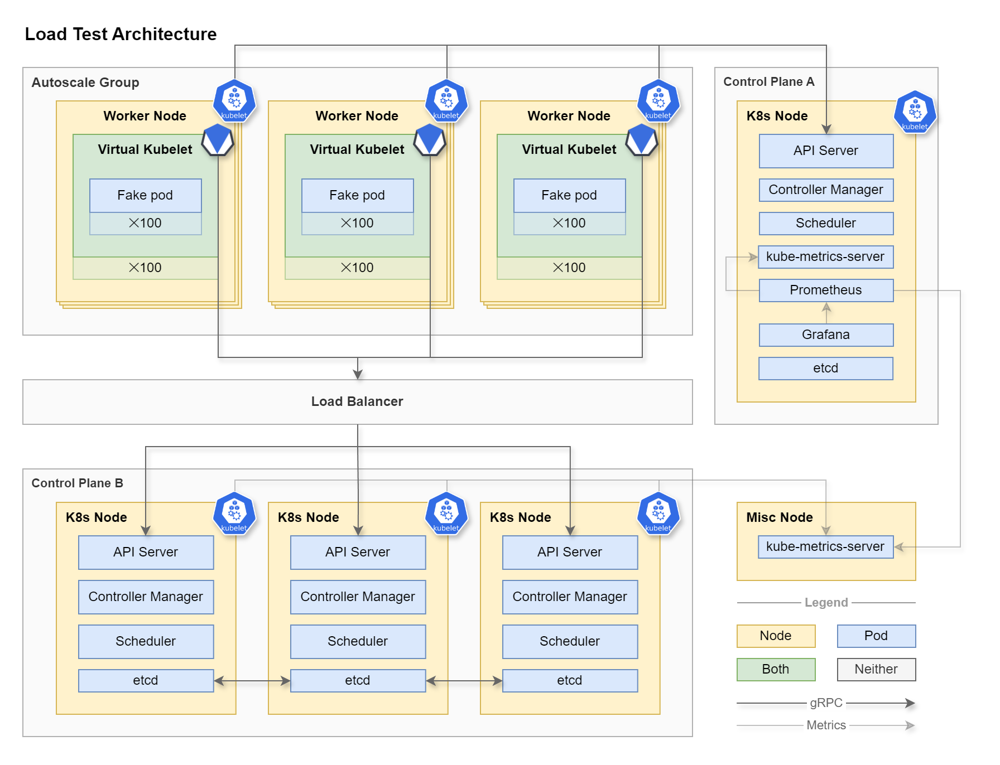

# TurboKube

A fork of Virtual Kubelet's [Mock Provider](https://github.com/virtual-kubelet/virtual-kubelet/blob/main/cmd/virtual-kubelet/internal/provider/mock/mock.go)
customized for load testing the Kubernetes Control Plane.

TurboKube can be used to simulate the load of a 10,000 node
cluster with a million pods using only a handful of virtual machines.

## Once upon a time on LinkedIn…

Someone complained about Kubernetes.

This project was created to map the performance characteristics of the Kubernetes control plane.

Account limits in every available cloud provider would prevent us from spinning up the 5,000 nodes required to reach
the published [Kubernetes performance limits](https://kubernetes.io/docs/setup/best-practices/cluster-large/).

We will need to compress the load if we want to reach the upper echelons of Kubernetes scalability.

Hence...

        

## Why Turbo?

A *turbo charger* works by compressing air before it enters a car's engine cylinder so that more fuel can be
burnt on every stroke, increasing horsepower without adding more cylinders. More power, less weight.

*TurboKube* is like a turbo charger because it cab amplify the load on a Kubernetes control plane by several orders of
magnitude. One node in *Cluster A* can present itself as one hundred (or more) nodes in *Cluster B* (the system under
load).

## Architecture

*Control Plane A* schedules [Virtual Kubelet](https://virtual-kubelet.io/) containers as pods in an autoscaling pool of
worker nodes. Each Virtual Kubelet operates a mock provider (TurboKube). Those Virtual Kubelets connect to
*Control Plane B*, joining the cluster pretending to be real virtual machines.

*Control Plane B* schedules Pods to these Virtual Kubelets. The pods scheduled to the Virtual Kubelets are real to
*Cluster B* but "fake" to *Cluster A* because the pods don't exececute anything in any real sense. The Virtual Kubelet
doesn't have a container runtime in which to run the containers in the pod spec. Instead, the provider simulates the
behavior of a running container including healthchecks, metrics, etc.

All of this is orchestrated with Terraform and a bunch of manually applied shell scripts. After the system is
provisioned, performance tests are run using [kube-burner](https://github.com/kube-burner/kube-burner) (wip).

## Experiment Variables

- Size of control plane instances (vertical scale, cores and ram)
- Number of control plane instances (horizontal scale)
- Load types (few large deployments vs many small deployments)
- Control plane topology (colocated vs offloaded: etcd, scheduler, etc)
- Control plane configuration (api server cache size, etcd knobs, etc)

## Experiment Goals

1. Learn a lot about operating the kubernetes control plane
2. Identify soft and hard failure points
3. Publish a control plane instance size recommendation calculator
4. Test performance of alternate etcd implementations
