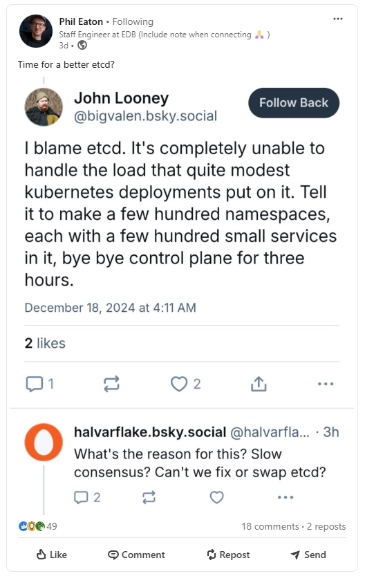
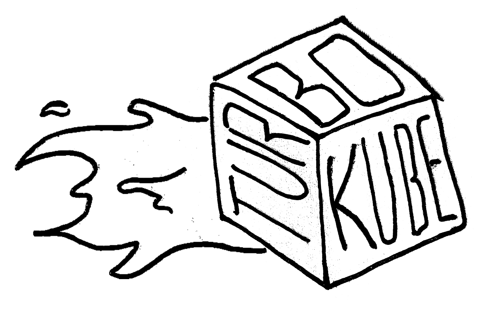
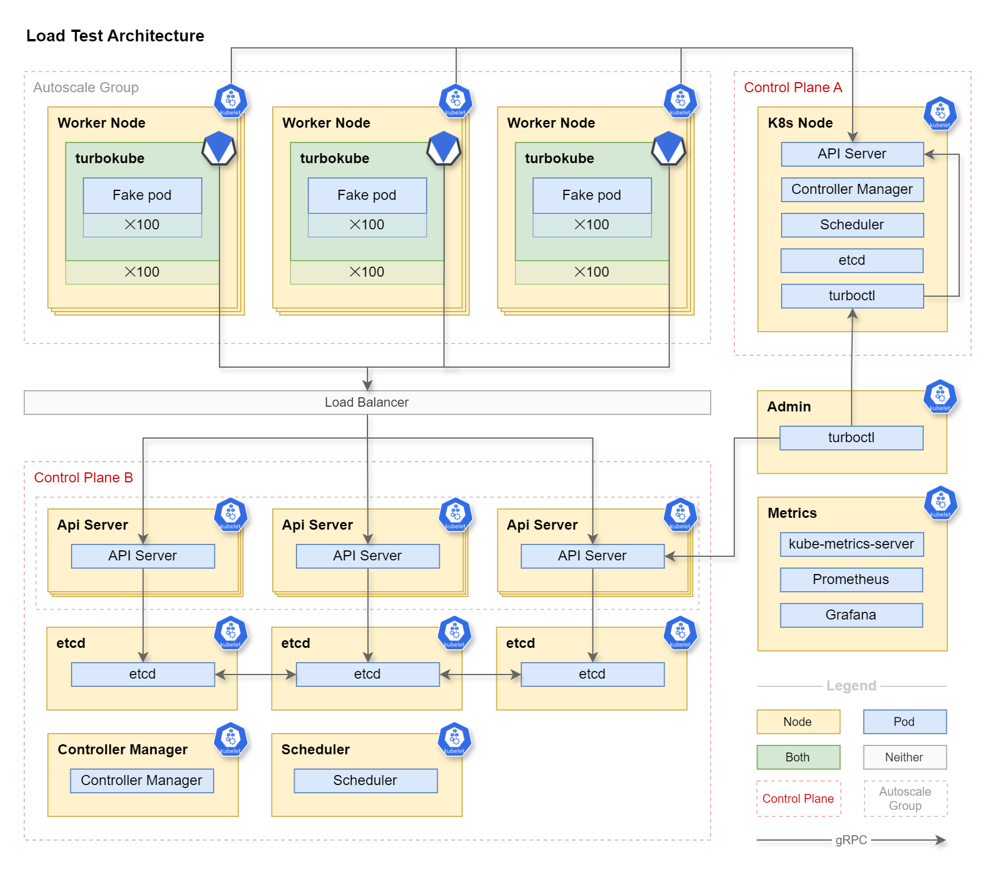

# TurboKube

A fork of Virtual Kubelet's <a href="https://github.com/virtual-kubelet/virtual-kubelet/blob/main/cmd/virtual-kubelet/internal/provider/mock/mock.go">Mock Provider</a>
designed specifically to load test the Kubernetes control plane. Simulate the load of a 10,000 node cluster using a
handful of small virtual machines.

## Once upon a time on LinkedIn…

…someone complained about Kubernetes.

This project was created to map the performance characteristics of the Kubernetes control plane.

Account limits in every available cloud provider prevent us from spinning up the 5,000 virtual machines required to
reach the published <a href="https://kubernetes.io/docs/setup/best-practices/cluster-large/">Kubernetes performance limits</a>
organically.

We will need to compress the load if we want to reach the upper echelons of Kubernetes scalability.

Hence...

        

## Why Turbo?

A *turbocharger* in a car works by compressing air entering the engine's cylinders so that more fuel can be burnt on
every stroke to increase horsepower without adding more cylinders, maximizing PWR (power to weight ratio).

A *turbopump* in a rocket engine works by preburning fuel and oxidizer to impel a turbine, pumping more fuel and
oxidizer at a faster rate into the main combustion chamber, maximizing TWR (thrust to weight ratio).

*TurboKube* is designed to amplify the load on a Kubernetes control plane using virtual nodes. One node in *Cluster A*
can present itself as one hundred (or more) nodes in *Cluster B* (the system under load).

*TurboKube* makes Kubernetes control plane load testing faster, cheaper and simpler.

## Architecture

*Control Plane A* schedules <a href="https://virtual-kubelet.io/">Virtual Kubelet</a> containers as pods in an autoscaling pool of
worker nodes. Each Virtual Kubelet operates a mock provider (TurboKube). Those Virtual Kubelets connect to
*Control Plane B*, joining the cluster pretending to be real virtual machines.

*Control Plane B* schedules Pods to these Virtual Kubelets. The pods scheduled to the Virtual Kubelets are real to
*Cluster B* but "fake" to *Cluster A* because it knows that the pods don't exececute anything in any real sense. The
Virtual Kubelet doesn't have a container runtime in which to run the containers in the pod spec. Instead, the provider
simulates the behavior of a running container including healthchecks, metrics, etc.

The infrastructure is provisioned using [terraform](terraform) and a bunch of manually applied shell scripts. After the
system is provisioned, load tests can be run using [turboctl](turboctl) (wip) on the admin node.

## Experiment Variables

- Size of control plane instances (vertical scale, cores and ram)
- Number of control plane instances (horizontal scale)
- Types of load (few large deployments vs many small deployments)
- Topology of control plane (colocated vs offloaded: etcd, scheduler, etc)
- Configuration of control plane (api server cache size, etcd knobs, etc)

## Experiment Goals

1. Learn a lot about operating the kubernetes control plane
2. Identify soft and hard failure points
3. Publish a control plane instance size recommendation calculator
4. Test performance of alternate etcd implementations

## Results

TBD

## Adjacent Work

- [KubeMark](https://github.com/kubernetes-sigs/cluster-api-provider-kubemark)
- [KWOK](https://kwok.sigs.k8s.io/)
- [SimKube](https://github.com/acrlabs/simkube)
- [kube-burner](https://github.com/kube-burner/kube-burner)

## Why not use something that already exists?

1. **Focus**  
Some of these tools (like [kube-burner](https://github.com/kube-burner/kube-burner)) might be a good fit
except that it can be hard to know precisely what is going on under the hood. I could read all 8,600 lines of code to
understand it completely and hope that its behavior matches my use case but it seems like all we're doing is applying
some templated manifest files to a cluster in a loop. I'd rather just build something simple for myself that's tailored
specifically to my project's goals so that it's easier for other people to comprehend.

2. **Simplicity**  
Some options like [KubeMark](https://github.com/kubernetes-sigs/cluster-api-provider-kubemark) are
packaged as plugins to complex projects like Cluster API. They include cloud provider integrations to provision
infrastructure as part of the load test. This might be valuable to organizations running automated load tests
continuously but that's not what we're doing here. I can't tell from the documentation if there's another less
complicated way to run it but I do know that the goals of this project do not require or warrant the operational
complexity of a cluster provisioning solution.

3. **Rigor**  
When testing the performance and correctness of a critical component, it can be valuable to have multiple
independent assessment frameworks to bring as many perspectives to the problem as possible. So in the grand scheme of
things, having multiple redundant testing frameworks with slightly different approaches in the industry can be a good
thing. [SimKube](https://github.com/acrlabs/simkube) has a number of interesting features that might be valuable, but
we don't have any large scale production traces to replay. Better to let those experts run their own independent tools
to validate the results of our tests for corroboration if required.
