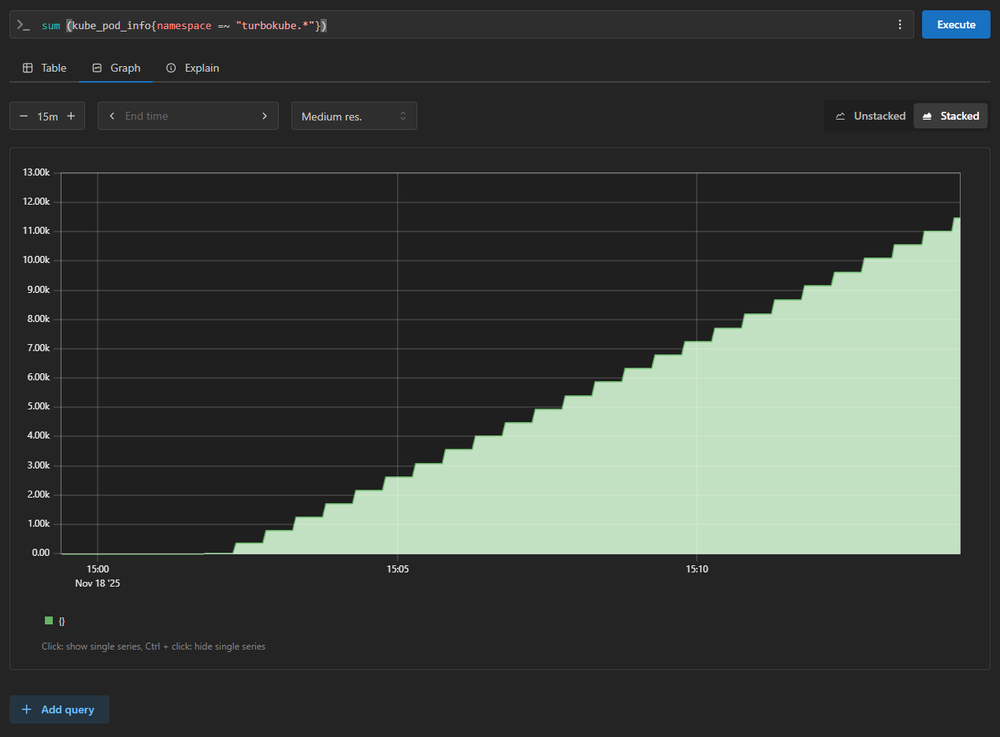

# TurboKube

<a href="https://www.digitalocean.com/?refcode=a16ca694958a&utm_campaign=Referral_Invite&utm_medium=Referral_Program&utm_source=badge"></a>

A fork of Virtual Kubelet's <a href="https://github.com/virtual-kubelet/virtual-kubelet/blob/main/cmd/virtual-kubelet/internal/provider/mock/mock.go">Mock Provider</a>
created to load test Kubernetes. This allows us to use a handful of virtual machines to simulate the
load that would be imposed on the Kubernetes control plane by a 10,000 node Kubernetes cluster.

## Once upon a time on LinkedIn…


…someone complained about Kubernetes.

This project was created to map the performance characteristics of the Kubernetes control plane.

Account limits in every available cloud provider prevent us from spinning up the 5,000 virtual machines required to
reach the published <a href="https://kubernetes.io/docs/setup/best-practices/cluster-large/">Kubernetes performance limits</a>
organically.

We will need to compress the load if we want to reach the upper echelons of Kubernetes scalability.

<a href="https://www.horriblelogos.com/turbokube/"></a>

Hence...

<br/><br/><br/><br/><br/><br/><br/><br/>

## Architecture

TurboKube is designed to amplify the load on a Kubernetes control plane using virtual nodes. One node in Cluster A can present itself as hundreds of nodes in Cluster B (the system under load).

<a href="https://app.diagrams.net/#Uhttps://raw.githubusercontent.com/pantopic/turbokube/refs/heads/main/junk/turbokube.isolated.draw.io.png"></a>

*Control Plane A* schedules <a href="https://virtual-kubelet.io/">Virtual Kubelet</a> containers as pods in an
autoscaling pool of worker nodes. Each Virtual Kubelet joins *Control Plane B* as a Kubernetes node.

*Control Plane B* schedules Pods to these Virtual Kubelets as if they were real nodes.

## Why Turbo?

A *turbocharger* in a car works by compressing air entering the engine so that more fuel can be burnt on every stroke,
increasing horsepower without adding more cylinders, maximizing PWR (power to weight ratio).

A *turbopump* in a rocket engine works by pre-burning fuel and oxidizer to impel a turbine, forcing more fuel and
oxidizer into the main combustion chamber at a faster rate, maximizing TWR (thrust to weight ratio).

*TurboKube* is designed to amplify the load on a Kubernetes control plane using virtual nodes rather than real nodes,
maximizing LCR (load to cost ratio).

## Experiment Variables

- Size of control plane instances (vertical scale, cores and ram)
- Number of control plane instances (horizontal scale)
- Types of load (few large deployments vs many small deployments)
- Topology of control plane (colocated vs offloaded: etcd, scheduler, etc)
- Configuration of control plane (api server cache size, etcd knobs, etc)
- Scheduler (default vs [YuniKorn](https://github.com/apache/yunikorn-core))

## Experiment Goals

1. Learn a lot about operating the kubernetes control plane
2. Identify soft and hard failure points
3. Publish a control plane instance size recommendation calculator
4. Test performance of alternate etcd implementations

## Operation

The infrastructure is provisioned using [terraform](terraform) and a tangled mess of manually applied shell scripts
that will be difficult for anyone else to follow because I never bothered to learn Ansible.

After the system is provisioned, load tests are run using [turboctl](turboctl) from the admin node which connects to
both control planes at once to coordinate creation of virtual nodes and workloads scheduled upon them.

```sh
# [8k test] 4 schedulers | 1,024 namespaces | 8,192 nodes | 32,768 deployments | 262,144 pods
> ./turboctl run basic -c 4 -n 1024
```

## Findings

About $300 was spent in infrastructure costs with Digital Ocean to run a series of tests over the course of several
weeks between November 15th and December 12th, 2025 with bottlenecks identified and mitigated along the way.

Findings are summarized here. More detailed notes and graphs can be found in the [results](results) directory.

### 1. Resource Requests

If you don't include resource requests in your pod spec, the kubernetes scheduler won't attempt to balance the
workload. I thought it would try to schedule the same number of pods to each node but that's not how it works at all.
It simply schedules each pod to a random node regardless of how many pods are assigned to each node.

```yaml
apiVersion: apps/v1
kind: Deployment
spec:
  template:
    spec:
      containers:
      - name: turbokube
        resources:
          requests:
            memory: 32Mi
```

The balancing logic in the Kubernetes scheduler is driven entirely by resource requests so they are not optional.

### 2. Sequential Scheduling

Even if you create multiple schedulers and utilize them correctly, those schedulers will not be run in parallel
because scheduling is a sequential process in Kubernetes. No matter how many schedulers you have or how they are
configured, Kubernetes will always schedule one pod at a time no matter what. This is the ultimate bottleneck.

### 3. Lease Management

Lease renewal throughput grows linearly with the number of nodes (as suspected).


The percentage of work dedicated to lease maintenance increases with the number of nodes in the cluster, reducing
available database throughput.


The system may eventually reach a point where it is completely saturated with lease maintenance and can't do any real work.


However, Kubernetes seems to have a good priority system so the ultimate failure mode may look more like a recovery
storm caused by undesired lease expiration as Kubernetes deprioritizes lease renewal requests.

### 4. QPS Limits

The default QPS limits in the scheduler and controller manager constrain the system to scheduling ~16 pods per second
(1k/min) at best. These limits must be [increased](/terraform/02-api-server-krv-2.sh#L40-L51) by a lot in order to
remove this artificial bottleneck. For anyone experiencing throughput issues running small self-managed Kubernetes
clusters out of the box, this is likely the bottleneck.



Turns out this jagged line is caused by the QPS limiter, not the metric sample rate as was originally assumed.

### 5. Container Network Interface

PodCidr management is a going concern at these scales. In this respect, Calico is a lot more flexible than Flannel as
a CNI (Container Network Interface). Recommend [Calico](https://docs.tigera.io/calico/latest/about/).

### 6. Alternate Etcd Implementations

Even with a different Raft implementation
([dragonboat](https://github.com/lni/dragonboat)) and a different storage engine
([LMDB](https://www.symas.com/mdb)), our independent etcd implementation
([config-bus](https://github.com/pantopic/config-bus)) displays nearly identical performance to
[etcd](https://github.com/etcd-io/etcd) in
the 8k test which, while heartening, suggests that the database is still not the bottleneck since we should expect some
variance in performance between the two.


The Kubernetes scheduler is the likely bottleneck.

### 7. Watch Cache

Disabling the watch cache is a really bad idea. It does a lot of work.


### 8. Taking it Further

Google's [130k blog post](https://cloud.google.com/blog/products/containers-kubernetes/how-we-built-a-130000-node-gke-cluster)
was released during the test period. Their test pre-provisions all nodes and then schedules 1 pod per node using
Kurrent. Presently, TurboKube can comfortably run about 400 vnodes per worker node with ram being the bottleneck. So if
the 8k test runs on a bank of 24 worker nodes with 2 cpu and 16GB of ram each at $0.15/hr, we'd need 384 worker nodes to
instantiate 128k vnodes to replicate Google's published results. Our droplet limit in DO is presently 100 so we'd either
need to request another limit increase or vertically scale each droplet to 128GB of ram and provision 48 of them. A
test of this size will probably cost us over $100 per run.

The other option would be to go back and re-evaluate [KWOK](https://kwok.sigs.k8s.io/) which is presumably much more
memory efficient since it runs multiple virtual kubelets in a single process rather than running each virtual kubelet
in a dedicated container.

In any event, we've proven performance parity of our etcd implementation at a scale of 8k nodes which is a good
performance baseline. Work continues on maturing our etcd implementation and we'll return to discover new ceilings
after the WASM migration is complete for our etcd implementation and we can begin testing our proposed multi-shard
approach to asynchronous lease management.

## Additional Findings

During this process, we identified a few minor defects in Digital Ocean's new
[Droplet Autoscaling](https://www.digitalocean.com/blog/droplet-autoscaling-now-available?refcode=a16ca694958a&utm_campaign=Referral_Invite&utm_medium=Referral_Program&utm_source=badge)
feature. Those defects were reported to Digital Ocean through their support system and the defects were quickly
reproduced and fixed by the Engineering Team at Digital Ocean.

Big thank you to Digital Ocean for listening and responding to customer feedback, even for a small customer like myself
who's been running $5 droplets on the platform for over 10 years.

## Adjacent Work

- [KubeMark](https://github.com/kubernetes-sigs/cluster-api-provider-kubemark)
- [KWOK](https://kwok.sigs.k8s.io/)
- [SimKube](https://github.com/acrlabs/simkube)
- [kube-burner](https://github.com/kube-burner/kube-burner)
- [CL2](https://github.com/kubernetes/perf-tests/tree/master/clusterloader2)

## Why not use something that already exists?

1. **Focus**
Some of these tools (like [kube-burner](https://github.com/kube-burner/kube-burner)) might be a good fit
except that it can be hard to know precisely what is going on under the hood. I could read all 8,600 lines of code to
understand it completely and hope that its behavior matches my use case but it seems like all we're doing is applying
some templated manifest files to a cluster in a loop. I'd rather just build something simple for myself that's tailored
specifically to my project's goals so that it's easier for other people to comprehend.

2. **Simplicity**
Some options like [KubeMark](https://github.com/kubernetes-sigs/cluster-api-provider-kubemark) are
packaged as plugins to complex projects like Cluster API. They include cloud provider integrations to provision
infrastructure as part of the load test. This might be valuable to organizations running automated load tests
continuously but that's not what we're doing here. I can't tell from the documentation if there's another less
complicated way to run it but I do know that the goals of this project do not require or warrant the operational
complexity of a cluster provisioning solution.

3. **Rigor**
When testing the performance and correctness of a critical component, it can be valuable to have multiple
independent assessment frameworks to bring as many perspectives to the problem as possible. So in the grand scheme of
things, having multiple redundant testing frameworks with slightly different approaches in the industry can be a good
thing. [SimKube](https://github.com/acrlabs/simkube) has a number of interesting features that might be valuable, but
we don't have any large scale production traces to replay. Better to let those experts run their own independent tools
to validate the results of our tests for corroboration if required.
